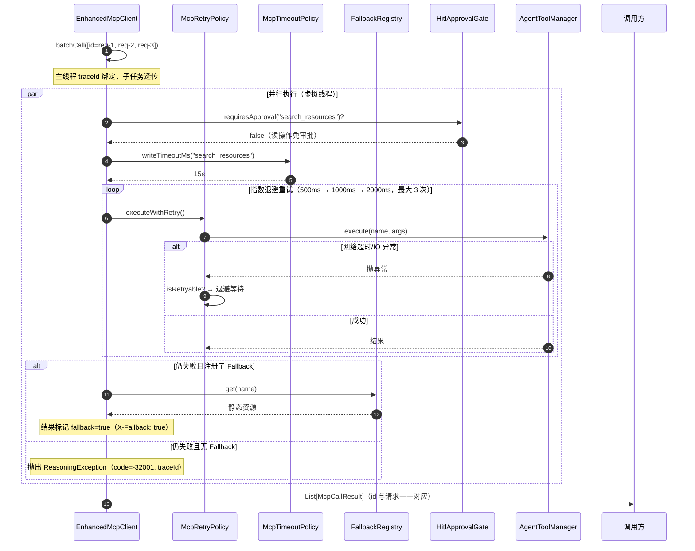
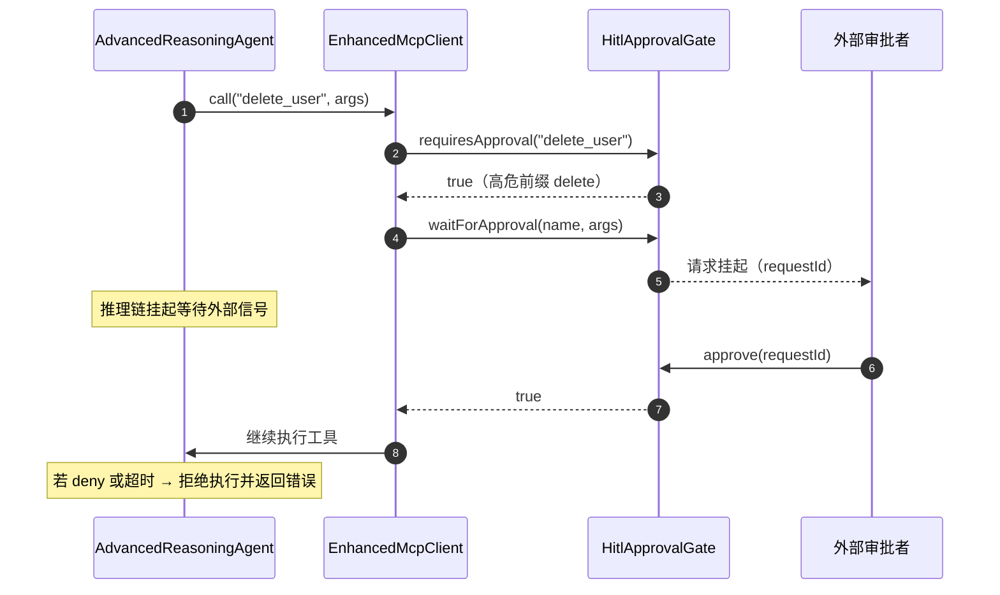
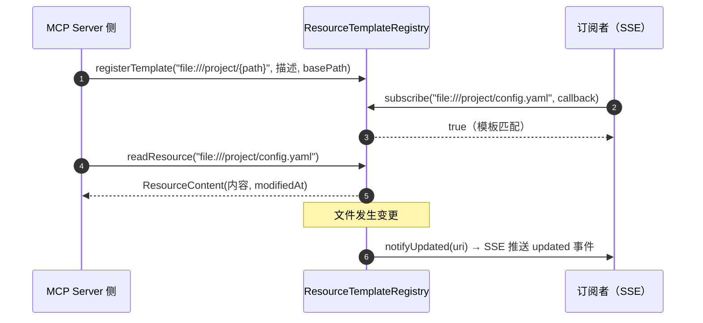

# 长链推理与 MCP 高级特性升级设计文档

> 版本：1.0.0 ｜ 适用：AI 学习规划师（Spring Boot 3.5.1 / Java 21 / Spring AI 1.1.7）
> 本文档对应《长链推理与动态调整（60%）》与《MCP 协议集成深度完善（70%）》两大模块的完整实现。

---

## 1. 总体架构

在现有 `BaseAgent → ReActAgent → ToolCallAgent` 线性推理链之上，新增 **推理引擎层（reasoning）**、**记忆层（memory）** 与 **MCP 高可用层（mcp/client·security·hitl·resource·prompt）**，形成「规划 → 执行 → 评估 → 反思 → 重规划」的自我纠偏闭环。

```
┌─────────────────────────────────────────────────────────────────┐
│                     AdvancedReasoningAgent                        │
│   (编排闭环：Planner → ToolCall → Evaluator → Reflection → Replan)│
└───────┬──────────────────────┬──────────────────────┬────────────┘
        │                      │                      │
   ┌────▼─────┐          ┌─────▼──────┐         ┌─────▼──────┐
   │ Planner  │          │ Evaluator  │         │ Reflection │
   │ LlmPlanner           │ 0-1 评分   │         │ Engine     │
   │ ToT/GoT/线性 │       │ <0.3 剪枝  │         │ JSON 反思  │
   └──────────┘          └────────────┘         └────────────┘
        │                      │                      │
   ┌────▼──────────────────────▼──────────────────────▼────┐
   │             EnhancedMcpClient（工具执行）              │
   │  批处理 · 动态超时 · 指数退避重试 · 降级 · HITL · 清洗 │
   └───────┬──────────┬──────────┬───────────┬─────────────┘
           │          │          │           │
    ┌──────▼──┐ ┌─────▼────┐ ┌──▼──────┐ ┌──▼──────────┐
    │Fallback │ │Hitl      │ │Security │ │Resource     │
    │Registry │ │Approval  │ │Filter + │ │Template     │
    │         │ │Gate      │ │Masker   │ │Registry     │
    └─────────┘ └──────────┘ └─────────┘ └─────────────┘
   ┌──────────────────────────────────────────────────────┐
   │   ContextCompressor（呼吸式上下文） + EpisodicMemory │
   │   ReasoningMonitor（Micrometer） + ReasoningTrace   │
   └──────────────────────────────────────────────────────┘
```

---

## 2. 类图（Class Diagram）

```mermaid
classDiagram
    class BaseAgent {
        #id: String
        #state: AgentState
        #messageList: List
        #maxSteps: int
        +run(input): String
        +runStream(input, emitter)
        #step(input): String*
        #pushThink/pushAction/pushObserve
    }
    class ReActAgent {
        #currentThought: String
        #currentAction: String
        #currentObservation: String
        +step(input): String
        #think(input): String*
        #act(thought): String*
        #observe(result): String
    }
    class ToolCallAgent {
        #agentToolManager: AgentToolManager
        #registerTools()*
        +think(input): String
        +act(thought): String
        #callLLM(prompt): String
        #buildToolPrompt(): String
    }
    class AdvancedReasoningAgent {
        -planner: Planner
        -evaluator: Evaluator
        -reflectionEngine: ReflectionEngine
        -replanningTrigger: ReplanningTrigger
        -contextWindow: ContextWindow
        -contextCompressor: ContextCompressor
        -episodicMemory: EpisodicMemory
        -mcpClient: EnhancedMcpClient
        -monitor: ReasoningMonitor
        -planRoot: PlanNode
        -currentPlanNode: PlanNode
        +step(input): String
        +think(input): String
        +act(thought): String
        +observe(result): String
        -afterStep(input, newObservation)
        -triggerReplan(reason)
        -maybeCompressContext()
    }
    class Planner {
        <<interface>>
        +generatePlan(goal, tools, topology): PlanningResult
        +generateAlternativePath(goal, failedNode, reason, tools): PlanNode
        +pruneBranch(node)
    }
    class LlmPlanner {
        -modelManager: ModelManager
    }
    class PlanNode {
        +id: String
        +description: String
        +type: NodeType
        +status: NodeStatus
        +score: double
        +addChild(desc, type): PlanNode
        +pathDescriptions(): List
        +pendingLeaves(): List
    }
    class PlanningResult {
        +goal: String
        +topology: Topology
        +root: PlanNode
        +alternativePaths: List
    }
    class Evaluator {
        +evaluate(node, output): StepScore
    }
    class StepScore {
        +score: double
        +rationale: String
        +suggestedAction: SuggestedAction
        +needsPruning(): boolean
    }
    class ReflectionEngine {
        +shouldReflect(toolCallCount): boolean
        +reflect(goal, recentSteps): ReflectionResult
    }
    class ReflectionResult {
        +status: Status
        +whatWorked: String
        +whatMissing: String
        +nextActionAdjustment: String
        +toJson(): String
        +parse(text): ReflectionResult
    }
    class ReplanningTrigger {
        +recordToolResult(success)
        +shouldReplan(contextRatio): boolean
        +reset()
    }
    class ContextWindow {
        +estimateTokens(text): int
        +usageRatio(messages): double
        +needsCompression(messages): boolean
    }
    class ContextCompressor {
        +compress(messages, systemPrompt, goal): CompressionResult
    }
    class EpisodicMemory {
        <<interface>>
        +store(episode)
        +search(query, topK): List
        +buildHiddenCoT(query, topK): String
    }
    class InMemoryEpisodicMemory {
        -episodes: List
        -vectorize(text): Map
        -cosine(a, b): double
    }
    class EnhancedMcpClient {
        +call(id, name, args): McpCallResult
        +batchCall(calls): List~McpCallResult~
        +getSanitizedToolDescriptions(): Map
    }
    class McpRetryPolicy {
        +executeWithRetry(name, attempt, executable)
        +isRetryable(e): boolean
        +backoffDelayMs(attempt): long
    }
    class McpTimeoutPolicy {
        +readTimeoutMs(name): long
        +writeTimeoutMs(name): long
        +isWriteTool(name): boolean
    }
    class FallbackRegistry {
        +register(name, content)
        +get(name): Optional
    }
    class HitlApprovalGate {
        +requiresApproval(name): boolean
        +waitForApproval(name, args): boolean
        +approve/deny(requestId): boolean
    }
    class SecurityFilter {
        +sanitize(desc): SanitizedResult
        +isSuspicious(text): boolean
    }
    class SensitiveDataMasker {
        +mask(text): String
        +mask(map): Map
    }
    class ResourceTemplateRegistry {
        +registerTemplate(uriTemplate, desc, basePath)
        +readResource(uri): Optional
        +subscribe(uri, callback): boolean
        +notifyUpdated(uri)
    }
    class PromptRegistry {
        +get(phase): String
        +register(phase, prompt)
    }
    class ReasoningMonitor {
        +recordStep/recordPrune/recordReplan()
        +recordToolDuration(ms)
        +recordToolFailure/Fallback()
        +recordReflection(status)
    }
    class ReasoningException {
        +traceId: String
        +stage: String
        +errorCode: int
    }
    class ReasoningTrace {
        +begin()/bind(id)/current()/clear()
    }

    BaseAgent <|-- ReActAgent
    ReActAgent <|-- ToolCallAgent
    ToolCallAgent <|-- AdvancedReasoningAgent
    Planner <|.. LlmPlanner
    EpisodicMemory <|.. InMemoryEpisodicMemory
    AdvancedReasoningAgent --> Planner
    AdvancedReasoningAgent --> Evaluator
    AdvancedReasoningAgent --> ReflectionEngine
    AdvancedReasoningAgent --> ReplanningTrigger
    AdvancedReasoningAgent --> ContextWindow
    AdvancedReasoningAgent --> ContextCompressor
    AdvancedReasoningAgent --> EpisodicMemory
    AdvancedReasoningAgent --> EnhancedMcpClient
    AdvancedReasoningAgent --> ReasoningMonitor
    LlmPlanner --> PlanNode
    LlmPlanner --> PlanningResult
    Evaluator --> StepScore
    Evaluator --> PlanNode
    ReflectionEngine --> ReflectionResult
    EnhancedMcpClient --> McpRetryPolicy
    EnhancedMcpClient --> McpTimeoutPolicy
    EnhancedMcpClient --> FallbackRegistry
    EnhancedMcpClient --> HitlApprovalGate
    EnhancedMcpClient --> SecurityFilter
    EnhancedMcpClient --> SensitiveDataMasker
    ReasoningException --> ReasoningTrace
```



---

## 3. 时序图（Sequence Diagram）

### 3.1 高级推理闭环（含评估/反思/重规划）

```mermaid
sequenceDiagram
    autonumber
    actor U as 用户
    participant A as AdvancedReasoningAgent
    participant P as LlmPlanner
    participant M as EnhancedMcpClient
    participant E as Evaluator
    participant R as ReflectionEngine
    participant T as ReplanningTrigger
    participant C as ContextCompressor
    participant Mem as EpisodicMemory
    participant Mon as ReasoningMonitor

    U->>A: run(目标)
    A->>A: ReasoningTrace.begin()
    Note over A: 呼吸式上下文检查
    A->>C: compress(messages)（使用率>70%时）
    C-->>A: 压缩后消息 + 压缩率
    A->>Mon: recordCompressionRatio(ratio)
    A->>Mem: buildHiddenCoT(目标)
    Mem-->>A: Hidden CoT 片段
    A->>P: generatePlan(目标, 工具, 拓扑)
    P-->>A: PlanningResult（线性/树状节点树）
    loop 每步执行
        A->>A: think（注入 Hidden CoT + 计划路径 + 反思调整）
        A->>M: call(工具, 参数)
        M->>M: 超时控制 + 指数退避重试
        M-->>A: McpCallResult
        A->>E: evaluate(节点, 观察结果)
        alt 得分 < 0.3
            E-->>A: PRUNE
            A->>Mon: recordPrune()
            Note over A: 剪枝回退上一节点
        else 得分正常
            E-->>A: CONTINUE
        end
        alt 连续失败 ≥ 2 次 或 上下文超阈值
            A->>T: shouldReplan(contextRatio)
            T-->>A: true
            A->>P: generateAlternativePath(目标, 失败节点)
            P-->>A: 绕行计划
            A->>Mon: recordReplan()
        end
        alt 每 3-5 次工具调用
            A->>R: reflect(目标, 最近步骤)
            R-->>A: ReflectionResult（JSON）
            A->>Mon: recordReflection(status)
        end
    end
    A-->>U: 执行结果
```



### 3.2 批量调用 + 超时重试 + 降级（EnhancedMcpClient）



### 3.3 高危工具人工审批（HITL）



### 3.4 资源模板订阅（resources/templates + Subscription）



---

## 4. 模块实现明细

### 4.1 长链推理与动态调整

| 能力         | 类                                                               | 关键行为                                                                                                                                                          |
| :----------- | :--------------------------------------------------------------- | :---------------------------------------------------------------------------------------------------------------------------------------------------------------- |
| 多路径规划   | `Planner` / `LlmPlanner` / `PlanNode` / `PlanningResult` | 线性 / 树状（ToT）/ 图状（GoT）拓扑；`generateAlternativePath` 生成绕行计划；LLM 不可用规则兜底                                                                 |
| 步骤评估     | `Evaluator` / `StepScore`                                    | 隐式奖励模型 LLM 评分 0-1；`< 0.3` 自动剪枝回退上一节点；空输出/失败标记规则预检                                                                                |
| 动态重规划   | `ReplanningTrigger`                                            | 工具连续失败 ≥2 次 或 上下文使用率 >85% 强制中断当前路径                                                                                                         |
| 呼吸式上下文 | `ContextWindow` / `ContextCompressor`                        | Token 估算（中文 1 字≈1 Token，英文 4 字符≈1 Token）；使用率 >70% 触发摘要压缩，保留系统指令 / 活跃目标 / 最近 3 轮                                             |
| 情景记忆     | `EpisodicMemory` / `InMemoryEpisodicMemory`                  | 中文 bigram + 英文词频向量余弦相似度；新推理链启动注入 Hidden CoT                                                                                                 |
| 自我反思     | `ReflectionEngine` / `ReflectionResult`                      | 每 3-5 次工具调用强制反思；输出`status/what_worked/what_missing/next_action_adjustment` JSON；stalled 触发重规划                                                |
| 推理闭环     | `AdvancedReasoningAgent`                                       | 编排全部能力；FINISH 步骤不重复评估；失败标记驱动失败计数                                                                                                         |
| 异常透明     | `ReasoningException` / `ReasoningTrace`                      | 携带 traceId + 阶段 + 错误码（-32000~-32099）；MDC 注入；禁止吞异常                                                                                               |
| 监控         | `ReasoningMonitor`                                             | Micrometer：`reasoning.steps.total`、`reasoning.tool.duration`（p50/p95/p99）、`reasoning.prune/replan/reflection/tool.failure/fallback` 计数、压缩率 gauge |

### 4.2 MCP 协议集成深度完善

| 能力         | 类                              | 关键行为                                                                                                                                                  |
| :----------- | :------------------------------ | :-------------------------------------------------------------------------------------------------------------------------------------------------------- |
| 批量调用     | `EnhancedMcpClient.batchCall` | 多个 FunctionCall 并行合并执行（虚拟线程）；响应 id 与请求一一对应；同批共享 traceId                                                                      |
| 动态超时     | `McpTimeoutPolicy`            | 按工具配置读超时（15s）与写超时（30s）；写操作前缀识别（exec/write/delete...）；读 < 写约束校验                                                           |
| 指数退避重试 | `McpRetryPolicy`              | 初始 500ms × 2 倍，最大 3 次；仅网络/超时/IO 异常可重试（cause 链识别）；业务异常不重试                                                                  |
| 降级预案     | `FallbackRegistry`            | 静态 MCP Resource 注册；核心 Server 不可用时自动降级并标记`fallback=true`（X-Fallback: true）                                                           |
| 人工审批     | `HitlApprovalGate`            | write/delete/exec 高危前缀 + 显式注册；`wait_for_approval` 挂起 CompletableFuture；approve/deny 外部唤醒；超时默认拒绝；默认 2 分钟可配置               |
| 注入防御     | `SecurityFilter`              | description 注入 LLM 前清洗 SYSTEM:/IGNORE/DISREGARD/You are GPT/im_start/HTML 注释等模式                                                                 |
| 敏感脱敏     | `SensitiveDataMasker`         | 日志/参数自动遮盖 Authorization、api_key、password、token 等字段及 Bearer/Basic 凭证 →`[REDACTED]`                                                     |
| 资源模板     | `ResourceTemplateRegistry`    | `resources/templates` 接口：URI 模板（`file:///project/{path}`）、`readResource` 解析、`subscribe` 订阅 + `notifyUpdated` SSE 推送 updated 事件 |
| 动态提示词   | `PromptRegistry`              | `prompts/get`：按推理阶段（debugging/planning/coding/analysis/general）动态拉取系统提示词，默认内置 5 套                                                |

### 4.3 安全栅栏执行点

```
MCP Server 返回工具描述 ──► SecurityFilter.sanitize ──► 注入 LLM 上下文
工具调用参数 ──► SensitiveDataMasker.mask ──► 日志输出（[REDACTED]）
高危工具（write/delete/exec*）──► HitlApprovalGate.wait_for_approval ──► 挂起/放行
工具执行失败 ──► McpRetryPolicy（网络类重试）──► FallbackRegistry（降级）──► ReasoningException（无降级时）
```

---

## 5. 配置说明（application.yml 新增段）

```yaml
app:
  reasoning:
    max-steps: 30
    topology: linear            # linear | tree | graph
    evaluate-prune-threshold: 0.3
    reflection-interval: 3      # 每 N 次工具调用反思
    replan-consecutive-failures: 2
    context-total-tokens: 30720
    context-compress-threshold: 0.7
    context-replan-threshold: 0.85
    hidden-cot-topk: 3
  mcp:
    retry-initial-delay-ms: 500
    retry-multiplier: 2.0
    retry-max-attempts: 3
    read-timeout-ms: 15000
    write-timeout-ms: 30000
    hitl-default-timeout-ms: 120000
```

---

## 6. 测试与验收对照

| 验收项        | 测试                                                        | 覆盖点                                                                                                                            |
| :------------ | :---------------------------------------------------------- | :-------------------------------------------------------------------------------------------------------------------------------- |
| 动态重规划    | `DynamicReplanningIntegrationTest`（@SpringBootTest）     | 正常闭环不触发重规划；连续失败 2 次触发`generateAlternativePath`（monitor.replan ≥1）；评估 <0.3 触发剪枝（monitor.prune ≥1） |
| 超时重试      | `McpTimeoutRetryIntegrationTest` / `McpRetryPolicyTest` | 指数退避 500→1000→2000ms；网络异常重试 2 次后成功（共 3 次调用）；业务异常不重试                                                |
| 降级预案      | `McpTimeoutRetryIntegrationTest`                          | 持续失败 + 有 Fallback →`fallback=true`（X-Fallback: true）                                                                    |
| JSON-RPC 契约 | `McpTimeoutRetryIntegrationTest`                          | 批量响应 id 与请求一一对应；error code ∈ [-32099, -32000]；traceId 非空且同批一致                                                |
| 注入防御      | `SecurityFilterTest`                                      | SYSTEM:/IGNORE/im_start/HTML 注释清洗；正常描述不动                                                                               |
| 脱敏          | `SensitiveDataMaskerTest`                                 | Bearer/api_key/password/Authorization → [REDACTED]                                                                               |
| HITL          | `HitlApprovalGateTest` + 集成测试                         | 高危前缀识别；approve/deny/超时拒绝；未审批工具不执行                                                                             |
| 呼吸式压缩    | `ContextCompressorTest`                                   | >70% 触发；保留系统指令/活跃目标/最近 3 轮；压缩率 >0                                                                             |
| 情景记忆      | `InMemoryEpisodicMemoryTest`                              | 语义检索 top-1 命中；Hidden CoT 注入格式                                                                                          |
| 评估剪枝      | `EvaluatorTest`                                           | 空输出/失败标记 → PRUNE；LLM 评分解析；规则兜底                                                                                  |
| 反思 JSON     | `ReflectionResultTest`                                    | 四字段 JSON 输出；状态解析与关键词推断                                                                                            |

**测试结果：69 个用例全部通过（0 失败 / 0 错误）**，覆盖：

- 单元测试 11 个类 57 例（安全 2 类、策略 2 类、记忆 2 类、推理 3 类、HITL 1 类、资源 1 类）
- @SpringBootTest 集成测试 2 个类 12 例（最小上下文，不依赖 MySQL/Redis）

---

## 7. 增量交付记录

| 阶段 | 内容                                                                             | 验证                     |
| :--- | :------------------------------------------------------------------------------- | :----------------------- |
| 一   | 异常体系 + traceId + 安全栅栏 + 高可用客户端 + HITL                              | `mvn compile` ✓       |
| 二   | 呼吸式上下文（ContextWindow/Compressor）+ 情景记忆                               | `mvn compile` ✓       |
| 三   | 多路径推理（Planner/Evaluator/Reflection/Replan）+ AdvancedReasoningAgent + 监控 | `mvn compile` ✓       |
| 四   | 资源模板订阅 + 动态提示词                                                        | `mvn compile` ✓       |
| 五   | 单元测试 + @SpringBootTest 集成测试                                              | `mvn test` ✓（69/69） |
| 六   | 设计文档 + 配置段                                                                | 本文档                   |
